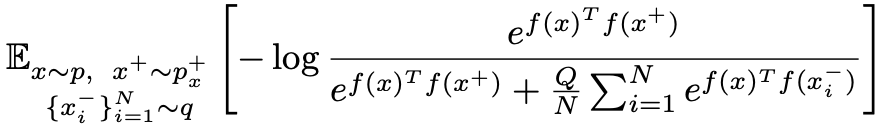

# Table of Contents

- [Table of Contents](#table-of-contents)
- [Multi-Task Learning](#multi-task-learning)
  - [An Overview of Multi-Task Learning in Deep Neural Networks (05.2017)](#an-overview-of-multi-task-learning-in-deep-neural-networks-052017)
    - [MTL methods](#mtl-methods)
    - [Reasons why MTL works](#reasons-why-mtl-works)
    - [Works in MTL for Deep Learning](#works-in-mtl-for-deep-learning)
    - [Auxiliary tasks](#auxiliary-tasks)
  - [Fully-adaptive Feature Sharing in Multi-Task Networks with Applications in Person Attribute Classification](#fully-adaptive-feature-sharing-in-multi-task-networks-with-applications-in-person-attribute-classification)
- [Architectures](#architectures)
  - [Deep Residual Learning for Image Recognition (ResNet)](#deep-residual-learning-for-image-recognition-resnet)
  - [EfficientNet: Rethinking Model Scaling for Convolutional Neural Networks](#efficientnet-rethinking-model-scaling-for-convolutional-neural-networks)
- [Optimization](#optimization)
  - [Contrastive learning with hard negative samples](#contrastive-learning-with-hard-negative-samples)
    - [Main Points](#main-points)
    - [Notations](#notations)
    - [More details](#more-details)
  - [COCO-DR: Combating Distribution Shifts in Zero-Shot Dense Retrieval with Contrastive and Distributionally Robust Learning](#coco-dr-combating-distribution-shifts-in-zero-shot-dense-retrieval-with-contrastive-and-distributionally-robust-learning)
- [Data Pruning](#data-pruning)
  - [DataComp: In search of the next generation of multimodal datasets](#datacomp-in-search-of-the-next-generation-of-multimodal-datasets)
    - [Main points](#main-points-1)
    - [Details](#details)
    - [Filtering Methods](#filtering-methods)
    - [Filtering methods I want to try](#filtering-methods-i-want-to-try)
    - [Metadata](#metadata)
  - [Beyond neural scaling laws: beating power law scaling via data pruning](#beyond-neural-scaling-laws-beating-power-law-scaling-via-data-pruning)
    - [Main Idea](#main-idea)
    - [Main graph to understand](#main-graph-to-understand)
    - [Pruning small vs large data sets](#pruning-small-vs-large-data-sets)
    - [Effect on transfer learning](#effect-on-transfer-learning)
    - [Their pruning algorithm](#their-pruning-algorithm)
  - [SemDeDup: Data-efficient learning at web-scale through semantic deduplication](#semdedup-data-efficient-learning-at-web-scale-through-semantic-deduplication)
  - [Dataset Cartography: Mapping and Diagnosing Datasets with Training Dynamics](#dataset-cartography-mapping-and-diagnosing-datasets-with-training-dynamics)

# Multi-Task Learning

## An Overview of Multi-Task Learning in Deep Neural Networks (05.2017)

- Sebastian Ruder
- [blog-post](https://ruder.io/multi-task/)
- [paper](https://arxiv.org/pdf/1706.05098.pdf)

This blog-post is an overview of multi-task learning papers.  
I will link to the original papers, and when/if I read them, I will summarize them here as well.

Multi-task learning is when you optimize multiple tasks in one model.  

### MTL methods

- Hard parameter sharing:  
  Sharing some hidden layers between all tasks - like in MOMO.
- soft parameter sharing:  
  Each task has different parameters, but the distance between them is regularized to make the parameters similar.  
  For example $l_2$ norm or [Trace Norm](https://arxiv.org/abs/1606.04038)  

### Reasons why MTL works

- Learning multiple tasks enables learning a better representation of the data.
- Attention focusing - MTL helps a model focus its attention on features that matter, as other tasks provide evidence for the relevance of those features.
- Eavesdropping - Some features F that are important for a task A might be difficult to learn directly for task A. Maybe because F interacts with A in a complex way.  
  With MTL you can learn a task B which makes learning F easier, or even directly learn F, a method called [Learning from hints](https://www.sciencedirect.com/science/article/pii/0885064X9090006Y?via%3Dihub)
- Representation Bias - MTL biases the model to prefer representations that other tasks also prefer. This will help the model generalize for other tasks as well as long as they are from the same [environment](https://arxiv.org/abs/1106.0245)

### Works in MTL for Deep Learning

- [Deep Relationship Networks](https://arxiv.org/abs/1506.02117) - Adding prior to the fully connected layers in the heads. **I don't know what this means exactly, need to read the paper**.
- [Fully Adaptive Feature Sharing](https://arxiv.org/abs/1611.05377) - Starting from a network with no split to heads, and dynamically widen it greedily during training.
  

  
  

- [Cross-stitch Networks](https://ieeexplore.ieee.org/document/7780802) - Soft parameter sharing. Instead of normal regularization over the parameters between different backbones, they use a "cross-stitch" unit which learns in what way to share the parameters between tasks.
- [Low Supervision](https://www.aclweb.org/anthology/P16-2038/) - Lower level tasks are supervised at lower layers. NLP related, but might be interesting.
- [Weighting losses with uncertainty](https://arxiv.org/abs/1705.07115) - A way to weight loss according to task dependant uncertainty.
- [MTL Representation Learning](https://arxiv.org/abs/1605.06391) - Using tensor factorization approach (don't know what this means yet). Something about splitting the model parameters into shared and task-specific parameter in every layer.
- [Latent Multi-task Architecture Learning](https://arxiv.org/abs/1705.08142) - A paper that says it solves all the problems with MTL together (which layers should be shared with multiple tasks, how much to share of each layer, the weights of each task when sharing).

### Auxiliary tasks

Tasks that you don't need to learn, but learning them might improve performance of the tasks that you do need to learn.

- Related task - Self explanatory.  
  Examples:
  - [Representation Learning Using Multi-Task Deep Neural Networks
for Semantic Classification and Information Retrieval](https://www.aclweb.org/anthology/N15-1092/)
  - [Facial Landmark Detection by Deep Multi-task Learning](https://link.springer.com/content/pdf/10.1007/978-3-319-10599-4_7.pdf)
- Adversarial: [Unsupervised Domain Adaptation by Backpropagation](https://arxiv.org/abs/1409.7495). **What I got from reading the abstract is:** In this paper they want to learn task A but have labels for unrelated (or even opposite) task B. They use representation unsupervised learning to learn general features, as well as learning the **opposite** of task B, meaning they try to maximize the loss of task B. The motivation is that the model learns only the general features of the input that are unrelated to task B.
- Hints - Learning sub tasks which direct the net to learn some of the features necessary for a possibly more complicated task.  
  Examples in NLP:
  - [Learning Sentence Embeddings with Auxiliary Tasks for Cross-Domain Sentiment Classification](https://www.aclweb.org/anthology/D16-1023.pdf)
  - [Open-Domain Name Error Detection using a Multi-Task RNN](https://www.aclweb.org/anthology/D15-1085.pdf)
- Focus attention - Explicitly learn features which might be helpful for the main task that the net might ignore otherwise. For example, for learning to steer, learn lane marking as well. Lane marking are a very small part of the image and might not even be present, but learning them is closely related to steering.
- Quantization smoothing - Some tasks such as approval, multi-class have discrete labels. Learning an auxiliary task that is smoother might help the classification as well.  
  For example:
  - Learn Intersection over union to help with learning approval
  - Learn how much of the vehicle is out of image/occluded when learning OOI/occlusion (We don't have the correct labels for occlusion, but we do for out of warp).
- Predicting inputs - Instead of using our features as inputs, predict them. In images it's kind of like cutout in self supervised.  
  Example paper: [Promoting Poor Features to Supervisors: Some Inputs Work Better as Outputs](https://citeseerx.ist.psu.edu/viewdoc/download?doi=10.1.1.48.1482&rep=rep1&type=pdf)
- Predicting the future - In training we have information about future frames. Since in real time we don't have that information, we can't use it as input. But we can predict it in training as an auxiliary task.
- Representation learning - Learn a representation of the input data that is not necessarily closely related to the tasks we want to learn themselves. Instead learn a more general representation. For example the task in [SimCLR](https://arxiv.org/pdf/2002.05709.pdf) is to tell if 2 augmentation came from the same original image, or from 2 different images.

## Fully-adaptive Feature Sharing in Multi-Task Networks with Applications in Person Attribute Classification

- Yongxi Lu, Abhishek Kumar, Shuangfei Zhai, Yu Cheng, Tara Javidi, Rogerio Feris
- [paper](https://arxiv.org/abs/1611.05377)

One of the issues with MTL is knowing which tasks to share and how much. This paper suggests an automation for deciding on the MTL architecture. 

# Architectures

## Deep Residual Learning for Image Recognition (ResNet)

- Kaiming He, Xiangyu Zhang, Shaoqing Ren, Jian Sun.
- [paper](https://arxiv.org/pdf/1512.03385.pdf)
- [blogpost](https://towardsdatascience.com/understanding-and-visualizing-resnets-442284831be8)

Very deep models are beneficial, but vanishing/exploding gradients is an issue when training them and performance start degrading.  
ResNet solves this issue by adding residual blocks to training:

Consider x to be the input to a block (a few stack layers), and H(x) as the mapping to be fit by this block. Define $F(x) := H(x) - x => H(x) = F(x) + x$.  
As seen in the image above, the idea of a residual block is to pass x directly to the end of the block, let the block learn $F(x)$ and simply add $F(x) + x$ to get $H(x)$.  
The 2 reasons I got why this works are:  

- When the net is very deep, you want to make it easy for it to use the identity mapping, kind of like "skip this layer".
- The gradient flows directly through the identity mapping that skips each residual block, which combats the vanishing gradient issue.

## EfficientNet: Rethinking Model Scaling for Convolutional Neural Networks

- Mingxing Tan, Quoc V. Le,
- [paper](https://arxiv.org/pdf/1905.11946.pdf)
- [blogpost](https://medium.com/@nainaakash012/efficientnet-rethinking-model-scaling-for-convolutional-neural-networks-92941c5bfb95)

EfficientNet coordinates the scaling of width, depth and resolution of a net to increase performance efficiently.
Formally it tries to solve this optimization problem:

where $d, w, r$ are the coefficients for scaling network depth, width, and resolution; $F_i$, $L_i$, $H_i$, $W_i$, $C_i$ are predefined parameters in a baseline network (for example ResNet).  
The way they did it is by using a compound coefficient $\theta$ with these constraints:

The reason width and resolution are squared is because increasing them times x will increase FLOPS times $x^2$, while increasing the depth times x will increase FLOPS times x.  
The way to find $\theta$, $\alpha$, $\beta$, and $\gamma$ is with these 2 steps:

- Fix $\theta = 1$, do a grid search for $\alpha$, $\beta$, and $\gamma$. This will give us a baseline net.
- Fix $\alpha$, $\beta$, and $\gamma$, and scale $\theta$ as much as you can/want.

Conclusion: This is probably one of the better ways we have right now to decide on an architecture.  
Note: We can actually experiment with different resolutions since we use AOTF.

# Optimization

## Contrastive learning with hard negative samples

- Joshua Robinson, Ching-Yao Chuang, Suvrit Sra, Stefanie Jegelka
- [paper](https://arxiv.org/pdf/2010.04592.pdf)
- [5 minute lecture](https://crossminds.ai/video/contrastive-learning-with-hard-negative-samples-60c3d1a86af07cfaf7325cce/)

### Main Points

- In contrastive learning we want to sample *good* negative samples.
- They develop an unsupervised sampling method for selecting hard negative samples.
- The idea is to sample negative samples that their representation is currently very similar to the anchor representation and their label is different from the anchor.
- They use an importance sampling technique that enables them to sample the usual way (at random) while TODO

### Notations

Data points:

- $x$: data sample (anchor)
- $x^+$: positive pair of x
- $x^-$: negative pair of x

Basics:

- $t$: temperature scaling hyperparameter
- $\mathbb{S}^{d-1}/t$: hypersphere in $\mathbb{R}^d$ of radius $1/t$
- embedding $f: \mathcal{X}\rightarrow \mathbb{S}^{d-1}/t$
- $\mathcal{C}$: set of classes.
  - More in depth: set of discrete latent classes that represent semantic context. $x, x^+$ have the same latent class.
- $h: \mathcal{X}\rightarrow \mathcal{C}$: The true labels hypothesis

Distributions:

- $\rho(c)$: Distribution over latent classes.
- $p_{x, c}(x, c)=p(x|c)\rho(c)$
- $p=p(x)$
- $\tau^+=\rho(c)=\frac{1}{|\mathcal{C}|}$: assuming uniform distribution of classes
- $\tau^- = 1 - \tau^+$: The probability of another class
- $x \sim x' \Rightarrow h(x)=h(x')$
- $p_x^+(x')=p(x'|h(x')=h(x))$: The distribution over points with same label as $x$
- $p_x^-(x')=p(x'|h(x') \neq h(x))$: The distribution over points with different label from $x$
- $x \sim p$: x sampled from p
- $q$: negative sampling distribution - this is what we want to do in a smart way
- $\beta$: Concentration parameter that controls the degree by which $q_{\beta}$ (below) up-weights points $x'$ that have large inner product to the anchor x
- $q_{\beta, x}(x')=q_{\beta}(x') = e^{\beta f(x)^Tf(x')}p(x')$: weighted sampling from $p$ based on how much the sample $x'$ is close to $x$
- $q_b^-(x^-) = q_b(x^-|h(x) \neq h(x^-))$: weighted sampling like $q_{\beta, x}(x^-)$ conditioned that $h(x) \neq h(x^-)$
- $q_b^+(x^-) = q_b(x^-|h(x) = h(x^-))$: weighted sampling like $q_{\beta, x}(x^-)$ conditioned that $h(x) = h(x^-)$

NCE (noise contrastive estimation):

- $N$: number of negative samples
- $Q$:  Weighting parameter
- $NCE(x)=$

### More details

Without labels you can't sample from a distribution $q=q_b^-(x^-)$ exactly. They suggest $q$ that satisfies this approximately.

$q_{\beta}(x^-) = q_{\beta}^+(x^-)\tau^+ + q_{\beta}^-(x^-)\tau^-$. Rearranging:  
$q_{\beta}^-(x^-) = q_{\beta}(x^-) - q_{\beta}^+(x^-)\tau^+/\tau^-$.  
This way we have $q_{\beta}^-(x^-)$ in terms of two distributions that are tractable:

- We have samples from $q_\beta^+$ because we have samples from $p$.
- We can approxiamte samples from $p^+$ (TODO how?: *"using a set of semantics-preserving transformations, as is typical in contrastive learning methods"*)

They sample from $q_\beta^+$ using importance sampling:

$NCE(x)$ can be view as finite negative sample approximation of:

We want $q=q_\beta^-$ so let's insert our rearrangement of $q_\beta^-$:

This means we can approximate *expectations* over $q_\beta, q_\beta^+$ rather than explicitly sampling.  
We do this by using Monte-Carlo importance sampling using samples from $p, p^+$ (TODO how to sample from $p^+$?)

Where $Z_\beta, Z_\beta^+$ are the partition functions (TODO check what are they).  
We can empirically approximate $p, p^+, Z_\beta, Z_\beta^+$

Where $\delta_w$ denotes the Dirac delta function centered at $w$  

TODO continue from section 4 in the paper

## COCO-DR: Combating Distribution Shifts in Zero-Shot Dense Retrieval with Contrastive and Distributionally Robust Learning

- Yue Yu, Chenyan Xiong, Si Sun, Chao Zhang, Arnold Overwijk
- [paper](https://arxiv.org/pdf/2210.15212.pdf)

They want to improve zero shot dense retrieval under distribution shifts.  
First they show correlation between the similarity of the corpus/queries (in the target compared to the original distribution) to performance.

They improve zero-shot DR using 2 methods:

1. Continuous Contrastive Pretraining - tackling corpus distribution shift:  
   After getting access to the target distribution corpus (which is needed in order to index anything), continuously "pre-train" on the coprura using contrastive learning. A positive pair is 2 sequences from the same document, and negative samples are from the other documents.
2. Distributionally Robust Optimization - tackling query distribution shifts: They use implicit DRO (iDRO)

iDRO:  

First cluster source queries using K-means.  
Define the iDRO loss:

where $\alpha, \omega$ are per cluster weighting parameters.  
$\alpha_i$ up-weights clusters with higher training loss using the hyperparameter $beta$.  
$\omega$ is a learnable parameter that maximize the loss decreases on all clusters. Using some math and KL regularization, they get the following formula for $\omega$:

Results:  
iDRO specifically improves BEIR performance by 1.1%.

# Data Pruning

## DataComp: In search of the next generation of multimodal datasets

- Yair Carmon and 30+ more
- [paper](https://arxiv.org/pdf/2304.14108.pdf)
- [Website](https://www.datacomp.ai/)
- [github](https://github.com/mlfoundations/datacomp)

### Main points

- A participatory benchmark where the training code, model, computational budget are fixed and you imporove it by proposing new training sets
- They provide the **CommonPool** dataset of 12.8B image-text pairs from Common Crawl.
- They provide many baseline experiments on how to build/filter the dataset and how these filtering algorithms perform on different data/model sizes

### Details

- 4 data scales:

  - **XLarge**: 12.8B
  - **Large**: 1.28B
  - **Medium**: 128M
  - **Small**: 12.8M
- 38 downstream tasks
- standardized CLIP training code
- Filtering Baselines
- DataComp-1B - *1.4B samples dataset created using a simple filtering algorithm applied to the 12.8B candidate pool*

### Filtering Methods

- No filtering
- Random filtering
- Basic filtering:

  - Language: only English
  - Caption length: over 2 words and 5 characters
  - Image size: $AspectRatio < 3$ and $min(height, width) > 200$
  - Language + caption length
  - Language + caption length + image size

- CLIP score: Clip similarity score > threshold for different thresholds
- CLIP score + Language
- Text based filtering: Select sampes with text overlapping ImageNet (21K and 1K) class names
- Text-based sampling: Not clear.
- Image based filtering. Do these steps:

  1) Language + Caption length
  2) Cluster image embeddings (ViT-L/14) into 100K groups using Faiss
  3) Find the nearset neighbor cluster center for every ImageNet (21K, 1K) training example
  4) Keep examples whose corresponding cluster center is a nearest neighbor to at least one ImageNet image.

- Image based sampling: Do:

  1) Use the same logic as in filtering, but this time have a count $s_i$ for each cluster of the number of ImageNet images closest to it.
  2) Sample a cluster proportional to $s_i$
  3) Sample an example uniformly from this cluster

- ImageNet distance filtering: For each sample, get a distance to the closest ImageNet image. Then keep % with the lowest distance.

### Filtering methods I want to try

Remove "mislabeled" points:

- Filter the XL dataset using CLIP with a very high threshold and use it in the smaller scale competitions of BYOD
- [Deconstructing Distributions: A Pointwise Framework of Learning](https://arxiv.org/pdf/2202.09931.pdf): Filter non-monotonic data points.
- [Characterizing Datapoints via Second-Split Forgetting](https://proceedings.neurips.cc/paper_files/paper/2022/file/c20447998d6c624b4b97d4466a3bfff5-Paper-Conference.pdf): Identifying "mislabeled" data points. In the context of CLIP style models, it might corelate to image and text mismatch.

Remove easy/uninformative/repetitive points:

- [Beyond neural scaling laws: beating power law scaling via data pruning](https://arxiv.org/pdf/2206.14486.pdf)
- [SemDeDup: Data-efficient learning at web-scale
through semantic deduplication](https://arxiv.org/pdf/2303.09540.pdf)

Combining the 2 approaches sounds interesting (take 1 from "Remove mislabeled points" and 1 from Remove uninformative/repetitive points)

### Metadata

- image url
- alt-text caption
- orignial image width, height
- CLIP ViT-B/32 and ViT-L/14 image and text features
- CLIP ViT-B/32 and ViT-L/14 image and text similarity score

## Beyond neural scaling laws: beating power law scaling via data pruning

- Ben Sorscher, Robert Geirhos, Shashank Shekhar, Surya Ganguli, Ari S. Morcos
- [paper](https://arxiv.org/pdf/2206.14486.pdf)
- [10 minute explanation](https://www.youtube.com/watch?v=joZaCw5PxYs)  
- [Metric scores git](https://github.com/rgeirhos/dataset-pruning-metrics)

### Main Idea

The authors show theoretically and empirically that when you have a large amount of data, a smart pruning method can break neural scaling law. Meaning that instead of the usual scaling law where the error falls off as a power of the training set and model size, it falls exponentially fast.  
They then compare existing pruning methods empirically and suggest an unsupervised pruning method based on their theory that works very well compared to other unsupervised methods.  

### Main graph to understand

- x axis is scaling the total dataset size.
- y axis is the test error.
- Each line represents % of data kept. For example 60% means that 40% of the data was pruned in an optimal way.
- Looking at the black like (100% data kept) we can see the usual power that looks like a linear line in a double logarithmic scale.
- The other lines show us that the more data you have, the more agressive pruning you can do. And when you don't have enough data it might be better not to prune at all.  

### Pruning small vs large data sets

Another thing the show (theoritically and empirically) is that small data sets benefit from pruning hard samples while large data sets benefit from pruning easy samples as shown in the figure below. It makes sense as the authers say:  
*"Intuitively, in the limited data regime, it is challenging to model outliers since the basics are
not adequately captured; hence, it is more important to keep easy examples so that the model can get
to moderate error. However, with a larger dataset, the easy examples can be learned without difficulty,
making modeling outliers the fundamental challenge."*

### Effect on transfer learning

- Pruning fine tune data: *"fine-tuning on only 10% of CIFAR-10 can match
or exceed performance obtained by fine tuning on all of CIFAR-10"*
- Pruning pre-train data: *"pre-training on as little as 50% of ImageNet can match or exceed CIFAR-10
performance obtained by pre-training on all of ImageNet"*

### Their pruning algorithm

- Take a pretrained self-supervised model trained on the dataset
- Perform k-means clustering in the embedding space
- Define the difficulty of each data point by the distance to its nearest cluster centroid
- Keep some % (on imagenet 80% performs well) most difficult samples samples

## SemDeDup: Data-efficient learning at web-scale through semantic deduplication

- Amro Abbas, Kushal Tirumala, Dániel Simig, Surya Ganguli, Ari S. Morcos
- [paper](https://arxiv.org/pdf/2303.09540.pdf)

Cluster the images using K-means (K=50,000). Within each cluster, compute pairwise cosine similarity and set threshold to determine which pairs are considered semantic duplicates.  
From each group of semantic duplicates, keep the 1 with the lowest cosine similarity to the cluster centroid and remove the rest.  
They tried 3 options for choosing which points to keep and there wasn't much of difference between them

1) keeping examples with low similarity to centroids
2) keeping random examples
3) keeping examples with high similarity to cluster centroids.

Mikey: Think about leaving the sample with the "best" text (best CLIP text to image similarity/long text or something else).  

Note on time complexity: Performing cosine similarity between all pairs requires $O(n^2)$ time. Using k clusters reduces the time complexity to $O(n^2/k)$.  

Removing 37% using SemDeDup increases OOD performance on LAION-440M which is an already curated dataset "*LAION
data were filtered using a pre-trained CLIP model to only retain image-text pairs with an embedding
similarity greater than 0.28. Image-text pairs containing very short captions or small images were
also removed. A simple de-duplication method based on the image url was also performed.*"

## Dataset Cartography: Mapping and Diagnosing Datasets with Training Dynamics

- Swabha Swayamdipta, Roy Schwartz, Nicholas Lourie, Yizhong Wang, Hannaneh Hajishirzi†, Noah A. Smith†, Yejin Choi
- [paper](https://arxiv.org/pdf/2009.10795.pdf)
- [github](https://github.com/allenai/cartography)

They look at data samples across training epochs and split them into 3 catogries corresponding to 3 regions on their "data map":

- instances whose true class probabilities fluctuate frequently during training (high variability), and are hence ambiguous for the model
- easy-to-learn instances that the model predicts correctly and consistently (high confidence, low
variability)
- hard-to-learn instances with low confidence, low variability.

Definitions:

- **confidence**: mean model probability of the true label across epochs.
- **correctness**: fraction of times the model classified the sample correctly
- **variability**: std of the same values as in confidence.

Unlike [Deconstructing Distributions](https://arxiv.org/pdf/2202.09931.pdf) these definitions are not related to the order of the epochs.

Claims:  

- Training on **ambiguous instances** promotes generalization to OOD test sets, with little or no effect on in-distribution (ID) performance.
- There are a lot of **easy-to-learn** instances that are not critical for ID or OOD performance, but without any such instances, training could faild to converge
- **hard-to-learn** instances frequently correspond to labeling errors
- They use the confidence measure to train a linear classifier that predicts mislabels and get decent results.

Sampling methods:

- forgetting: training examples that transitioned from being classified correctly to incorrectly over the course of learning
- AL-uncertainty: The algorithm selects unlabeled examples that it finds hardest to classify
- AFLite: adversarial filtering algorithm which ranks instances based on their “predictability”, i.e. the ability of simple linear classifiers to predict them correctly

