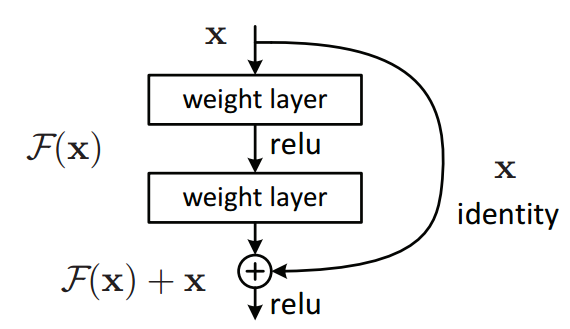

# Table of Contents

- [Table of Contents](#table-of-contents)
- [Multi-Task Learning](#multi-task-learning)
  - [An Overview of Multi-Task Learning in Deep Neural Networks (05.2017)](#an-overview-of-multi-task-learning-in-deep-neural-networks-052017)
    - [MTL methods](#mtl-methods)
    - [Reasons why MTL works](#reasons-why-mtl-works)
    - [Works in MTL for Deep Learning](#works-in-mtl-for-deep-learning)
    - [Auxiliary tasks](#auxiliary-tasks)
  - [Fully-adaptive Feature Sharing in Multi-Task Networks with Applications in Person Attribute Classification](#fully-adaptive-feature-sharing-in-multi-task-networks-with-applications-in-person-attribute-classification)
- [Architectures](#architectures)
  - [Deep Residual Learning for Image Recognition (ResNet)](#deep-residual-learning-for-image-recognition-resnet)
  - [EfficientNet: Rethinking Model Scaling for Convolutional Neural Networks](#efficientnet-rethinking-model-scaling-for-convolutional-neural-networks)

# Multi-Task Learning

## An Overview of Multi-Task Learning in Deep Neural Networks (05.2017)

- Sebastian Ruder
- [blog-post](https://ruder.io/multi-task/)
- [paper](https://arxiv.org/pdf/1706.05098.pdf)

This blog-post is an overview of multi-task learning papers.  
I will link to the original papers, and when/if I read them, I will summarize them here as well.

Multi-task learning is when you optimize multiple tasks in one model.  

### MTL methods

- Hard parameter sharing:  
  Sharing some hidden layers between all tasks - like in MOMO.
- soft parameter sharing:  
  Each task has different parameters, but the distance between them is regularized to make the parameters similar.  
  For example $l_2$ norm or [Trace Norm](https://arxiv.org/abs/1606.04038)  

### Reasons why MTL works

- Learning multiple tasks enables learning a better representation of the data.
- Attention focusing - MTL helps a model focus its attention on features that matter, as other tasks provide evidence for the relevance of those features.
- Eavesdropping - Some features F that are important for a task A might be difficult to learn directly for task A. Maybe because F interacts with A in a complex way.  
  With MTL you can learn a task B which makes learning F easier, or even directly learn F, a method called [Learning from hints](https://www.sciencedirect.com/science/article/pii/0885064X9090006Y?via%3Dihub)
- Representation Bias - MTL biases the model to prefer representations that other tasks also prefer. This will help the model generalize for other tasks as well as long as they are from the same [environment](https://arxiv.org/abs/1106.0245)

### Works in MTL for Deep Learning

- [Deep Relationship Networks](https://arxiv.org/abs/1506.02117) - Adding prior to the fully connected layers in the heads. **I don't know what this means exactly, need to read the paper**.
- [Fully Adaptive Feature Sharing](https://arxiv.org/abs/1611.05377) - Starting from a network with no split to heads, and dynamically widen it greedily during training.
  

  
  

- [Cross-stitch Networks](https://ieeexplore.ieee.org/document/7780802) - Soft parameter sharing. Instead of normal regularization over the parameters between different backbones, they use a "cross-stitch" unit which learns in what way to share the parameters between tasks.
- [Low Supervision](https://www.aclweb.org/anthology/P16-2038/) - Lower level tasks are supervised at lower layers. NLP related, but might be interesting.
- [Weighting losses with uncertainty](https://arxiv.org/abs/1705.07115) - A way to weight loss according to task dependant uncertainty.
- [MTL Representation Learning](https://arxiv.org/abs/1605.06391) - Using tensor factorization approach (don't know what this means yet). Something about splitting the model parameters into shared and task-specific parameter in every layer.
- [Latent Multi-task Architecture Learning](https://arxiv.org/abs/1705.08142) - A paper that says it solves all the problems with MTL together (which layers should be shared with multiple tasks, how much to share of each layer, the weights of each task when sharing).

### Auxiliary tasks

Tasks that you don't need to learn, but learning them might improve performance of the tasks that you do need to learn.

- Related task - Self explanatory.  
  Examples: 
  - [Representation Learning Using Multi-Task Deep Neural Networks
for Semantic Classification and Information Retrieval](https://www.aclweb.org/anthology/N15-1092/)
  - [Facial Landmark Detection by Deep Multi-task Learning](https://link.springer.com/content/pdf/10.1007/978-3-319-10599-4_7.pdf)
- Adversarial: [Unsupervised Domain Adaptation by Backpropagation](https://arxiv.org/abs/1409.7495). **What I got from reading the abstract is:** In this paper they want to learn task A but have labels for unrelated (or even opposite) task B. They use representation unsupervised learning to learn general features, as well as learning the **opposite** of task B, meaning they try to maximize the loss of task B. The motivation is that the model learns only the general features of the input that are unrelated to task B.
- Hints - Learning sub tasks which direct the net to learn some of the features necessary for a possibly more complicated task.  
  Examples in NLP:
  - [Learning Sentence Embeddings with Auxiliary Tasks for Cross-Domain Sentiment Classification](https://www.aclweb.org/anthology/D16-1023.pdf)
  - [Open-Domain Name Error Detection using a Multi-Task RNN](https://www.aclweb.org/anthology/D15-1085.pdf)
- Focus attention - Explicitly learn features which might be helpful for the main task that the net might ignore otherwise. For example, for learning to steer, learn lane marking as well. Lane marking are a very small part of the image and might not even be present, but learning them is closely related to steering.
- Quantization smoothing - Some tasks such as approval, multi-class have discrete labels. Learning an auxiliary task that is smoother might help the classification as well.  
  For example:
  - Learn Intersection over union to help with learning approval
  - Learn how much of the vehicle is out of image/occluded when learning OOI/occlusion (We don't have the correct labels for occlusion, but we do for out of warp).
- Predicting inputs - Instead of using our features as inputs, predict them. In images it's kind of like cutout in self supervised.  
  Example paper: [Promoting Poor Features to Supervisors: Some Inputs Work Better as Outputs](https://citeseerx.ist.psu.edu/viewdoc/download?doi=10.1.1.48.1482&rep=rep1&type=pdf)
- Predicting the future - In training we have information about future frames. Since in real time we don't have that information, we can't use it as input. But we can predict it in training as an auxiliary task.
- Representation learning - Learn a representation of the input data that is not necessarily closely related to the tasks we want to learn themselves. Instead learn a more general representation. For example the task in [SimCLR](https://arxiv.org/pdf/2002.05709.pdf) is to tell if 2 augmentation came from the same original image, or from 2 different images.

## Fully-adaptive Feature Sharing in Multi-Task Networks with Applications in Person Attribute Classification

- Yongxi Lu, Abhishek Kumar, Shuangfei Zhai, Yu Cheng, Tara Javidi, Rogerio Feris
- [paper](https://arxiv.org/abs/1611.05377)

One of the issues with MTL is knowing which tasks to share and how much. This paper suggests an automation for deciding on the MTL architecture. 

# Architectures

## Deep Residual Learning for Image Recognition (ResNet)

- Kaiming He, Xiangyu Zhang, Shaoqing Ren, Jian Sun.
- [paper](https://arxiv.org/pdf/1512.03385.pdf)
- [blogpost](https://towardsdatascience.com/understanding-and-visualizing-resnets-442284831be8)

Very deep models are beneficial, but vanishing/exploding gradients is an issue when training them and performance start degrading.  
ResNet solves this issue by adding residual blocks to training:

Consider x to be the input to a block (a few stack layers), and H(x) as the mapping to be fit by this block. Define $F(x) := H(x) - x => H(x) = F(x) + x$.  
As seen in the image above, the idea of a residual block is to pass x directly to the end of the block, let the block learn $F(x)$ and simply add $F(x) + x$ to get $H(x)$.  
The 2 reasons I got why this works are:  

- When the net is very deep, you want to make it easy for it to use the identity mapping, kind of like "skip this layer".
- The gradient flows directly through the identity mapping that skips each residual block, which combats the vanishing gradient issue.

## EfficientNet: Rethinking Model Scaling for Convolutional Neural Networks

- Mingxing Tan, Quoc V. Le,
- [paper](https://arxiv.org/pdf/1905.11946.pdf)
- [blogpost](https://medium.com/@nainaakash012/efficientnet-rethinking-model-scaling-for-convolutional-neural-networks-92941c5bfb95)

EfficientNet coordinates the scaling of width, depth and resolution of a net to increase performance efficiently.
Formally it tries to solve this optimization problem:

where $d, w, r$ are the coefficients for scaling network depth, width, and resolution; $F_i$, $L_i$, $H_i$, $W_i$, $C_i$ are predefined parameters in a baseline network (for example ResNet).  
The way they did it is by using a compound coefficient $\theta$ with these constraints:

The reason width and resolution are squared is because increasing them times x will increase FLOPS times $x^2$, while increasing the depth times x will increase FLOPS times x.  
The way to find $\theta$, $\alpha$, $\beta$, and $\gamma$ is with these 2 steps:

- Fix $\theta = 1$, do a grid search for $\alpha$, $\beta$, and $\gamma$. This will give us a baseline net.
- Fix $\alpha$, $\beta$, and $\gamma$, and scale $\theta$ as much as you can/want.

Conclusion: This is probably one of the better ways we have right now to decide on an architecture.  
Note: We can actually experiment with different resolutions since we use AOTF.
